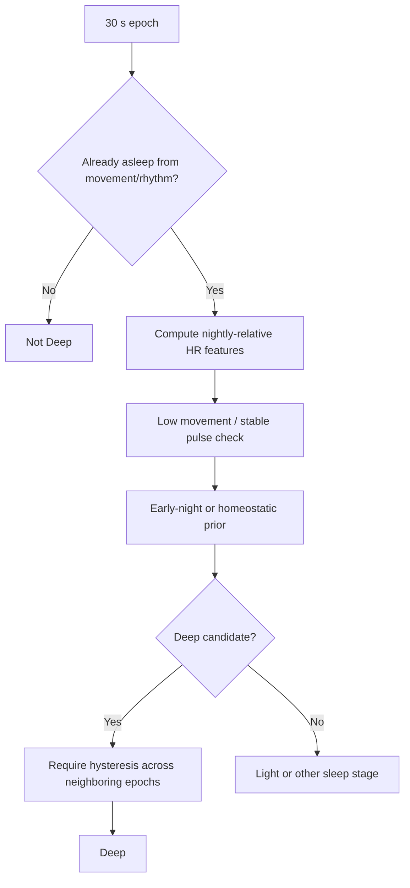
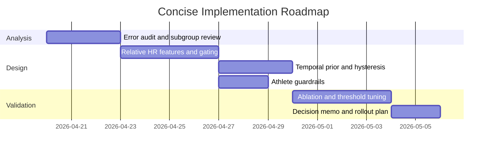

# Deep Research Report on Wrist-Based Deep-Sleep Classification

## Executive Summary

The attached markdown is a design-and-research brief for improving a rule-based sleep-stage classifier, with the immediate pain point being false **Deep** calls in athletic or low-resting-HR users when the current heuristic uses an absolute heart-rate rule such as `hr_mean <= baseline.resting_hr + 8`. It also asks whether the correct reference should be awake resting HR, nightly minimum HR, a percentile of the night’s HR distribution, or a more robust alternative; whether published wrist/finger wearable literature supports any of those choices; how the MESA benchmark pipeline handles normalization; and how athletic edge cases should be addressed. fileciteturn0file0

The research answer is fairly consistent across the best available sources: **do not anchor Deep sleep to a fixed offset from awake resting HR, and do not anchor it directly to nightly minimum HR either**. Published wearable sleep-staging systems do use cardiac information heavily, but the strongest papers rely on **relative or normalized cardiac features plus movement and temporal context**, not a single absolute bpm gate. In the most relevant public consumer-wearable paper from entity["company","Oura","wearable company"], features were normalized **per night** with a robust method based on the 5th–95th percentiles, explicitly because absolute physiological values vary widely across individuals. entity["company","Philips","electronics company"]’s HRV-plus-activity work and the Fitbit literature use many HRV and movement features in learned models, but do not disclose a fixed Deep threshold. SleepPPG-Net likewise standardizes features per patient rather than thresholding absolute HR. citeturn11view0turn10view2turn14view0turn15search5turn41view0turn42view0

My recommendation is therefore **Option 4: a hybrid relative gate**, not Options 1–3 as written. In practice, that means using: a confident “asleep” precondition from movement/rhythm; a **within-night relative HR feature** such as robust z-score or percentile rank; a **temporal prior** that favors N3 earlier in the night; and ideally an HRV or pulse-stability corroborator. If you need a single interpretable rule for now, use HR relative to the sleeper’s own overnight distribution rather than to an awake baseline or a raw nightly minimum. This is the design most aligned with physiology and with the public literature. citeturn11view0turn10view2turn24search17turn24search5turn42view0

## What the Attached Markdown Contains

The markdown’s core requirements are clear. It asks for a recommendation on which HR reference point should drive Deep-sleep classification; a literature review of published wearable staging systems; an explanation of whether HR alone can separate Deep from Light sleep; a specific look at MESA preprocessing and normalization; and practical advice for athletic users with low nightly HR. It also makes explicit that movement/rhythm features already establish “asleep,” so the real design problem is **Deep versus Light within already-sleep epochs**. fileciteturn0file0

The key extracted items are below.

| Extracted item | Type | Why it matters |
|---|---|---|
| Current Deep rule uses `baseline.resting_hr + 8` | Requirement / current design | This is the baseline to replace or revise. |
| False Deep calls occur when waking-in-bed HR is low | Problem statement | Indicates poor specificity around quiet wake and low-arousal light sleep. |
| Athletic user example with nightly minimum around 48 bpm | Data point / edge case | Suggests low-HR users break absolute thresholds. |
| Candidate alternatives: awake resting HR, nightly minimum HR, nightly percentile | Open design options | Frames the immediate algorithm choice. |
| Need literature review across public wearable papers | Research requirement | Means the answer should defer to public evidence, not intuition alone. |
| Need MESA-specific guidance | Benchmarking requirement | Implies reproducibility concerns separate from product design concerns. |
| Need handling for low-RHR / athletic populations | Risk and generalization requirement | Prevents overfitting the logic to average users. |

The file also leaves several assumptions unresolved. It does not specify whether scoring is **retrospective after the whole night** or **online during the night**; whether HRV is available at the same cadence as mean HR; whether the baseline `resting_hr` is a daytime measure, a sleep-derived measure, or vendor-defined; and how much labeled data exists for validating a change. Those ambiguities directly affect whether a percentile-based rule is implementable and whether a causal rolling baseline is preferable to a whole-night statistic. fileciteturn0file0

## Evidence and Answers to the Research Questions

The first important result is physiological. Sleep HR is usually lower than waking resting HR, and the decline is stage-dependent: during NREM, parasympathetic drive increases and cardiac sympathetic activity falls; the deepest NREM periods show the strongest slowing, while REM is more labile. Large-sample population data from the Fenland Study reported mean resting HRs of **67 bpm seated, 64 bpm supine, and 57 bpm during sleep**, which is exactly why an awake baseline is a poor anchor for stage discrimination inside already-sleep epochs. A clinical physiology source likewise notes that heart rate generally slows during NREM and is most reduced in the deepest NREM stages. citeturn31search3turn24search17turn24search5

The second result is methodological. In the public literature I reviewed, I did **not** find a mainstream wearable sleep-staging paper that disclosed a simple published rule of the form “Deep if HR is below the Xth percentile of the night” or “Deep if HR is within Y bpm of nightly minimum.” What I did find were three recurring patterns: learned HRV/movement feature sets, **per-night or per-patient normalization**, and the use of temporal/circadian context. That matters because it means the best public evidence supports **relative physiology and sequence context**, not an absolute bpm threshold. citeturn11view0turn10view2turn14view0turn42view0

The most directly relevant public consumer-wearable paper is the 2021 Oura paper. It collected 440 nights from 106 people and showed that for four-stage sleep staging, accelerometer-only models reached **57%** accuracy, while adding HRV improved performance to **76%**, and adding circadian features lifted it to **79%**. The authors explicitly state that autonomic differences between stages are captured as **relative changes over time within individuals**, and that features were normalized **per night using a robust method based on the 5th–95th percentiles** because absolute values vary greatly across people. That is almost a direct answer to the file’s design question: relative nightly normalization is not a hack; it is exactly what a strong public wearable paper chose to do. citeturn9view0turn11view0turn10view2

The Philips lineage points the same way. The 2020 Fonseca paper validated an algorithm using **132 HRV features and body movements** with recurrent neural networks in sleep-disordered populations, and the 2021 Wulterkens paper retrained that architecture on **wrist PPG plus accelerometry** for a clinical population. Both papers emphasize HRV plus movement, not a single absolute HR threshold; neither publicly discloses a rule like “Deep if below awake RHR plus N bpm.” Wulterkens also summarizes the physiology cleanly: as NREM deepens, parasympathetic activity rises, heart rate decreases, and REM becomes more unstable and sympathetic-dominant. citeturn15search5turn13view0turn14view0turn14view3

The 2017 Fitbit paper by Beattie et al. is also informative. It used wrist accelerometer and PPG features reflecting **movement, breathing, and HRV**, and achieved **69%** overall per-epoch accuracy with four classes. The paper explicitly frames the goal as learning correlations between true stages and physiological metrics such as movement, heart rate, HRV, and breathing. Again, nothing in the published method suggests a fixed absolute Deep threshold from awake resting HR; it is a multi-feature ML system. citeturn41view0

SleepPPG-Net, a more recent deep-learning paper, is even clearer on normalization. It extracted PRV/HRV and morphological PPG features and then **standardized those features on a per-patient basis**, explicitly to eliminate baseline differences between patients. This is not the same as per-night normalization, but it points in the same conceptual direction: **baseline cardiac level is individualized and needs normalization before staging logic becomes reliable**. citeturn42view0

That leaves the question of whether nightly minimum HR is a good reference point. The best answer is “better than awake resting HR, but still too brittle if used directly.” A small but useful study on sleeping heart rate found that **minimum heart rate during sleep varied by about 5 ± 3 bpm across repeated nights**, and the authors concluded that changes generally need to exceed about **10 bpm** before they can be interpreted confidently. A raw nightly minimum is therefore a noisy single point estimate. It is especially dangerous in athletes, because the night’s minimum may be **very** low even outside N3, and quiet wakefulness or low-arousal light sleep may sit near that lower range. citeturn25view0

The athletic literature reinforces that caution. In young endurance athletes, nocturnal and morning HR/RMSSD measures were strongly correlated and did not differ significantly at the weekly level, supporting the use of nocturnal indices for monitoring but also showing that low nightly HR is normal in that group. Separate overtraining literature suggests that nocturnal HRV can remain unchanged even when morning measures change, which is another warning that “very low sleeping HR” is not the same thing as “deep sleep.” In athletes, low HR is often a trait; N3 is not. citeturn32view0turn35search0turn35search13

The benchmark-specific question has a different answer, because reproducibility and physiology are not the same objective. In the public MESA benchmark repo on entity["company","GitHub","developer platform"], the dataset builder fits a **StandardScaler** on the training dataframe and applies it to train and test features. The DL cache uses a small feature set including `_Act`, `mean_nni`, `sdnn`, `sdsd`, `vlf`, `lf`, `hf`, `lf_hf_ratio`, and `total_power`. The repo README also notes a bug fix stating that **activity counts for DL models were not standardized**, and that fixing this should improve outcomes marginally. So if your goal is to reproduce the benchmark, you should follow the repo’s **train-set standardization convention**, not invent a different per-night normalization scheme in the benchmark path. citeturn20view1turn20view2turn21view0turn18search0

One final framing point is important. The clinical reference standard remains the scoring framework of the entity["organization","American Academy of Sleep Medicine","sleep medicine society"], and AASM has also cautioned that consumer sleep technology is not a substitute for validated clinical scoring or diagnosis. That does not reduce the value of your classifier; it simply means any heuristic you ship should be presented as a practical staging estimate rather than a diagnostic truth. citeturn44view1turn44view0

### Comparison of Publicly Relevant Approaches

| System / paper | Signals | Publicly disclosed threshold style | Most relevant takeaway |
|---|---|---|---|
| Altini & Kinnunen 2021 | Accel + temperature + HRV + circadian | **Per-night robust normalization** using 5th–95th percentiles; no fixed Deep bpm rule disclosed | Strongest public support for relative nightly normalization and temporal context. citeturn11view0turn10view2 |
| Fonseca 2020 | 132 HRV features + body movement | Learned RNN/LSTM model; no fixed Deep threshold disclosed | HRV + movement, not absolute HR cutoffs, drive staging. citeturn15search5 |
| Wulterkens 2021 | Wrist PPG + accelerometry | Same learned architecture family; no fixed Deep threshold disclosed | Wrist translation preserves HRV-plus-movement logic rather than exposing a bpm gate. citeturn13view0turn14view0 |
| Beattie 2017 | Wrist PPG + accelerometer | ML with movement, breathing, HRV features; no simple Deep threshold disclosed | Early consumer-wearable evidence already used multi-feature staging, not a raw HR rule. citeturn41view0 |
| Kotzen 2022 | Continuous PPG with PRV/morphology | **Per-patient standardization**; no fixed Deep threshold disclosed | Normalization of baseline physiology is central. citeturn42view0 |
| MESA benchmark repo | HRV + actigraphy features | **Training-set StandardScaler** for benchmark reproducibility | Use this for benchmark parity, not as proof that absolute HR is clinically ideal. citeturn20view1turn20view2turn21view0 |

## Recommended Design

The highest-confidence recommendation is to implement **Option 4: a hybrid relative gate**.

### Why Option 4 beats the three listed options

| Option | Cost | Complexity | Advantages | Main problem |
|---|---|---:|---|---|
| Option 1: `baseline.resting_hr + 8` | Low | Low | Easy to interpret and ship | Uses an awake anchor for an already-asleep staging problem; weak in low-RHR users. |
| Option 2: nightly minimum + offset | Low | Low | Uses sleep-state physiology rather than daytime physiology | Nightly minimum is noisy and athlete-biased. |
| Option 3: nightly percentile | Low–Medium | Medium | Relative to the night; more robust than a single minimum | Better than Options 1–2, but still too HR-only unless paired with stability and time context. |
| **Option 4: nightly-relative HR + motion/stability + circadian prior** | Medium | Medium | Best match to public literature; interpretable; robust across baseline differences | Needs slightly more engineering and validation. |
| Full probabilistic / ML stage model | Higher | High | Best long-run performance ceiling | More data, tooling, and QA burden. |

My recommended production rule sketch is:

A practical implementation can be:

- compute a **night-relative HR feature** such as robust z-score or percentile rank from sleep epochs only;
- require **low movement and pulse stability**;
- require an **early-night / homeostatic prior** because N3 is front-loaded across the night;
- optionally require **higher relative vagal tone** if HRV is available;
- apply **hysteresis** so one quiet low-HR epoch while awake in bed does not flip immediately to Deep. This design is an inference from the literature, not a disclosed vendor threshold, but it is the most evidence-consistent engineering choice. citeturn11view0turn10view2turn24search17turn42view0

A concrete starting rule could be:

- `asleep_confident == true`
- `movement_low == true`
- `night_hr_percentile <= 0.25` **or** `night_hr_robust_z <= -0.5`
- `epoch_in_first_half_of_night == true` or homeostatic-decay-prior high
- if HRV exists: `rmssd_relative >= threshold` or pulse regularity high
- enter Deep only after 2 of the last 3 epochs satisfy the rule
- exit Deep immediately on motion spike, REM-like instability, or wake transition

I would **not** use the whole-night minimum directly, and I would use whole-night percentiles only for retrospective scoring. If you need truly online scoring, replace the full-night percentile with a **causal rolling baseline** based on earlier stable-sleep segments.

### MESA-specific recommendation

For MESA work, separate the code path into two modes:

- **Benchmark mode**: reproduce the public repo exactly with train-set standardization, because that is what the benchmark code does. citeturn20view1turn21view0
- **Product mode**: add nightly relative normalization on top of raw or benchmark-aligned features, because per-night or per-person normalization is what the strongest physiological staging papers lean toward. citeturn10view2turn42view0

That separation avoids a common mistake: conflating a reproducibility pipeline with the best deployment physiology.

## Action Plan and Roadmap

### Prioritized action items

| Action | Priority | Estimated effort | Dependencies | Expected effect |
|---|---|---:|---|---|
| Audit current false-Deep epochs by low-RHR strata | High | 2–3 days | Existing labeled nights | Confirms where the current rule fails most. |
| Implement nightly-relative HR features | High | 2–4 days | Clean sleep-epoch segmentation | Removes dependence on awake baseline HR. |
| Add temporal prior and hysteresis | High | 2–3 days | Relative features in place | Reduces quiet-wake and transition false positives. |
| Add athlete guardrails | High | 1–2 days | User-level RHR / fitness tags if available | Prevents systematic overcalling in low-RHR users. |
| Benchmark against current rule with stratified ablations | High | 3–5 days | Labeled evaluation pipeline | Quantifies precision/recall tradeoffs by subgroup. |
| Consider migration to lightweight learned stage model | Medium | 1–2 weeks | Sufficient labeled data and QA bandwidth | Longer-term accuracy improvement ceiling. |

A reasonable implementation schedule is:

## Risks, Assumptions, and Open Issues

The main risk is **overfitting low-HR physiology to Deep sleep**. Very fit users, people on beta blockers, and some healthy sleepers can all show low nocturnal HR without being in N3. Public athlete literature and the broader autonomic literature both caution that resting nocturnal cardiac tone reflects recovery state and individual baseline, not only sleep stage. Mitigation is to require stage-consistent context: low movement, pulse stability, and an early-night prior, plus subgroup validation in low-RHR users. citeturn32view0turn35search0turn42view0

A second risk is **quiet wakefulness and REM confusion**. The public wearable literature repeatedly notes that stage confusions often involve wake/light and light/REM, precisely because movement alone is insufficient and cardiac dynamics can overlap at transitions. Mitigation is to treat Deep as a **conservative class** with hysteresis and exclusion logic rather than a permissive one-epoch label. citeturn41view0turn13view0turn9view0

A third risk is **benchmark/product mismatch**. If you change normalization in the MESA path, you may improve product logic but lose comparability to published benchmark results. Mitigation is to keep benchmark mode and deployment mode separate. citeturn20view1turn18search0

The central assumptions I had to make are that your device is a wrist wearable in the same problem class as entity["company","Fitbit","wearable company"]-, entity["company","WHOOP","wearable company"]-, and Oura-like systems; that your “asleep” detector already works reasonably well; and that you can compute at least mean HR, movement, and some notion of sleep epoch order across the night. The remaining open issue is whether you prefer a **fully interpretable heuristic** or are willing to adopt a lightweight learned model. If interpretability is the priority, the hybrid relative gate above is the best evidence-backed next step. If performance is the priority, the public literature points toward a compact HRV/movement sequence model rather than further tuning of an absolute bpm rule. citeturn41view0turn15search5turn11view0turn42view0